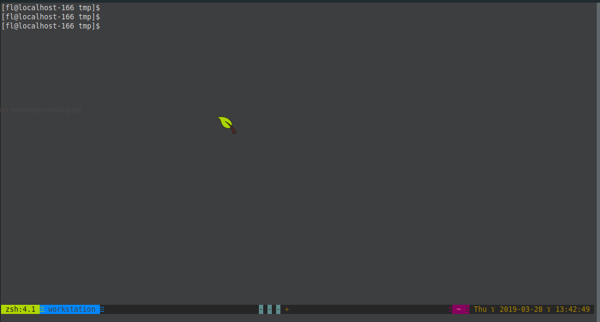

`gdb` 是一款通用的程序调试器，可以用于测试 `c`、`c++`、`java`、`python` 等多种程序语言。借用官方的解释，`gdb` 可以为我们提供至少以下强大的功能：

-   Start your program, specifying anything that might affect its behavior.
-   Make your program stop on specified conditions.
-   Examine what has happened, when your program has stopped.
-   Change things in your program, so you can experiment with correcting the effects of one bug and go on to learn about another.

但是，如果其他的 `GNU` 项目，`gdb` 本身也是一款终端命令工具(CLI)，只能通过命令交互的方式进行代码调试。如果我们想要实时的看到断点(break point) 运行到何处，则需要配合使用 `tui`(text user interface) 功能。目前， `gdb8.1` 及以上版本，均已实现了该功能。

接下来，我将介绍如何在 `CentOS` 操作系统下升级 `gdb8.1`。

<!--more-->

# 获取源文件

可以从官网获取最新的版本信息，[Download GDB](https://www.gnu.org/software/gdb/download/)。

```bash
cd ~/Downloads
wget ftp://sourceware.org/pub/gdb/releases/gdb-8.1.tar.xz
tar -xvf gdb-8.1.tar.xz
cd gdb-8.1
```

# 编译与安装

使用命令直接编译

```bash
./configure --prefix=/usr --with-system-readline
sudo make && make install
## 查看版本
gdb -v
```

# 调试

使用命令 `gdb` 进行调试，输入命令 `tui enable` 打开可视化界面。


